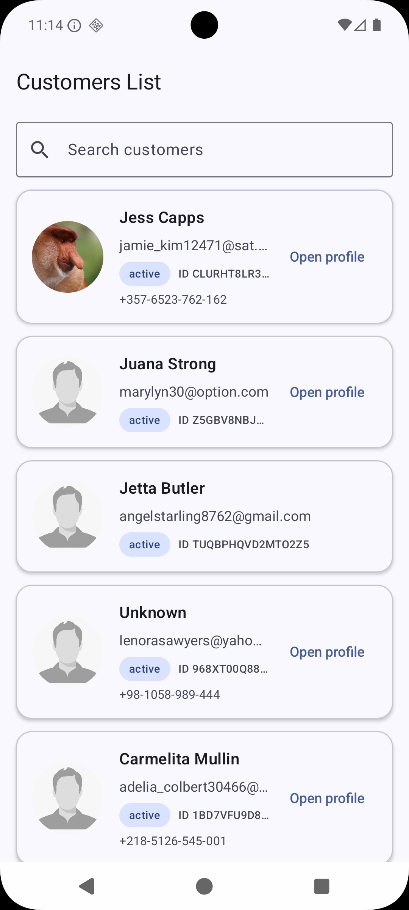
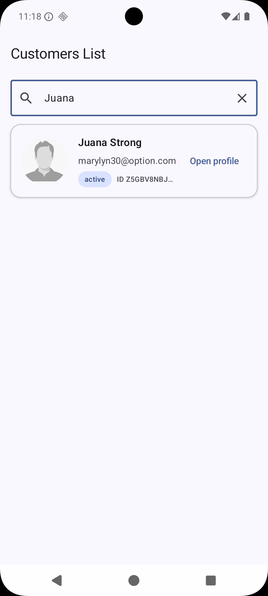
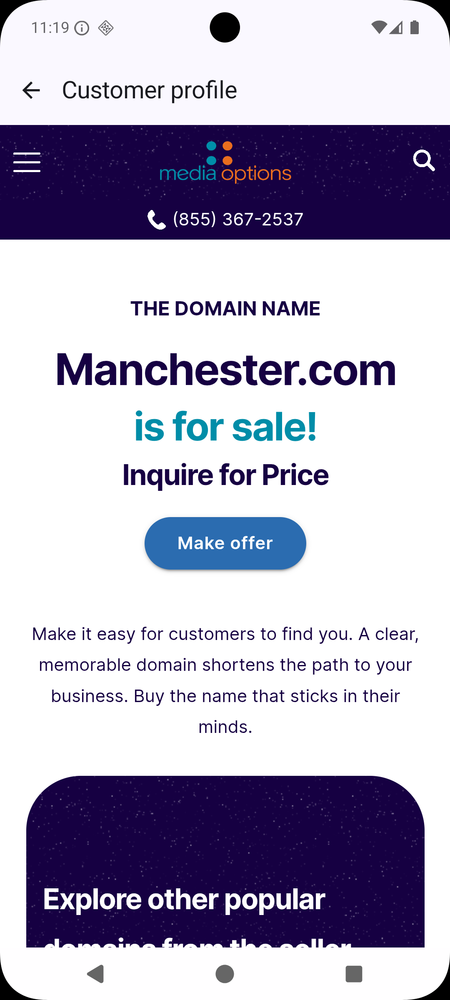
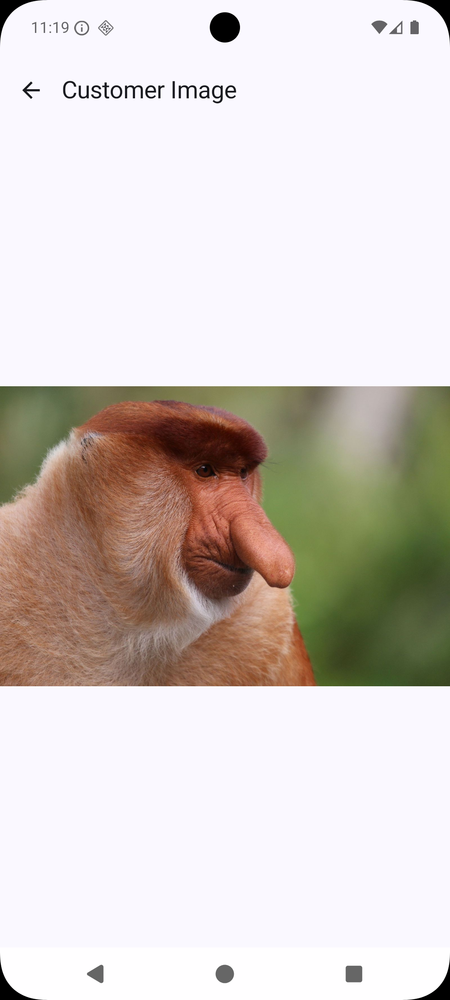

# Android Customer Challenge

Aplicativo Android desenvolvido como parte de um desafio técnico.

O projeto carrega clientes de um endpoint remoto, permite pesquisa local, abre o perfil do cliente em uma WebView, exibe a imagem em tela cheia e mantém uma conexão WebSocket que envia `hello` a cada 30 segundos.

---

## Funcionalidades

- Listagem de clientes
- Estados de loading, sucesso, vazio e erro
- Retry em falhas de rede
- Pesquisa local com debounce
- Busca por nome, e-mail, telefone e ID
- Perfil aberto em WebView
- Imagem de perfil em tela cheia
- Fallback para imagens inválidas
- Layout responsivo
- WebSocket com reconexão automática
- Testes unitários

---

## Screenshots

| Lista de clientes | Pesquisa |
|:---:|:---:|
|  |  |

| Perfil | Imagem em tela cheia |
|:---:|:---:|
|  |  |

---

## Tecnologias

- Kotlin
- Jetpack Compose
- Material 3
- Navigation Compose
- MVVM
- Clean Architecture
- Coroutines
- StateFlow e SharedFlow
- Retrofit
- OkHttp
- Coil
- Koin
- JUnit
- MockK

---

## Arquitetura

O projeto está separado em três camadas:

```text
data
domain
presentation
```

### Data

Responsável por:

- chamadas remotas;
- DTOs;
- mapeamento para domínio;
- tratamento de erros;
- implementação do repository;
- conexão WebSocket.

### Domain

Responsável por:

- modelos;
- contratos dos repositories;
- use cases.

### Presentation

Responsável por:

- telas Compose;
- ViewModels;
- navegação;
- `UIAction`;
- `UIState`;
- `UISideEffect`.

Fluxo principal:

```text
Compose
    ↓
CustomersViewModel
    ↓
GetCustomersUseCase
    ↓
CustomerRepository
    ↓
CustomerRemoteDataSource
    ↓
CustomerApi
```

---

## Pesquisa

A pesquisa é feita localmente sobre a lista já carregada.

Ela utiliza debounce para evitar filtragens desnecessárias enquanto o usuário digita rapidamente.

Campos pesquisáveis:

- nome;
- e-mail;
- telefone;
- ID.

Nenhuma nova requisição é feita durante a pesquisa.

---

## WebSocket

O aplicativo se conecta a:

```text
wss://ws.postman-echo.com/raw
```

Comportamento:

1. conecta quando o app entra em primeiro plano;
2. envia `hello`;
3. aguarda a resposta;
4. repete o envio a cada 30 segundos;
5. desconecta quando o app vai para segundo plano;
6. tenta reconectar após falhas inesperadas.

---

## Tratamento de erros

Repositories e UseCases retornam:

```kotlin
Result<T>
```

O ViewModel trata as falhas, atualiza o estado da tela, registra o erro e exibe feedback por Snackbar.

---

## Testes unitários

Foram adicionados testes para:

- Remote Data Source
- Mapper
- Repository
- UseCase
- ViewModel

Execute com:

```bash
./gradlew testDebugUnitTest
```

---

## Como executar

Clone o projeto:

```bash
git clone https://github.com/CaiioLima/android-customer-challenge.git
```

Depois:

1. abra no Android Studio;
2. aguarde o Gradle sincronizar;
3. selecione um emulador ou dispositivo;
4. execute o módulo `app`.

Não é necessário configurar chave de API.

---

## Endpoints

Clientes:

```text
https://raw.githubusercontent.com/newloran2/testApp2026/main/service.json
```

WebSocket:

```text
wss://ws.postman-echo.com/raw
```

---

## Autor

Desenvolvido por **Caio Lima**.
